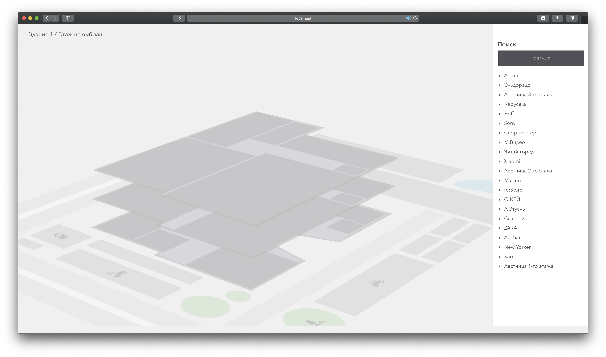
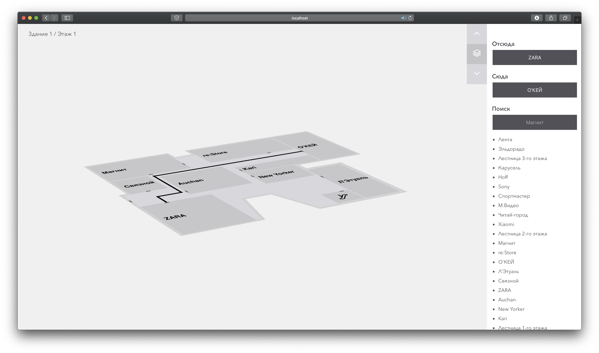

# Building plan using Svelte and ArangoDB
[](https://www.gnu.org/licenses/gpl-3.0)
[](https://github.com/FlymeDllVa/BuildingPlan/actions)
<a href="https://github.com/psf/black"></a>




## Description
The system uses the [ArangoDB](https://www.arangodb.com) base to build routes between points in the building.
Frontend renders [Svelte](https://svelte.dev)  JavaScript library. Frontend receives data from the database using HTTP requests to Backend, using the [FastAPI](https://fastapi.tiangolo.com) library, which brings data from [ArangoDB](https://www.arangodb.com) to the desired form.

Certain structure of JSON file is used to build the scheme. It describes everything necessary to build a graph by building and render SVG.

An example of the scheme necessary for the system to work is in the [examples folder](https://github.com/FlymeDllVa/BuildingPlan/blob/master/examples).
Also in this folder there is an example of SVG substrate for the building.
The folder also contains the [coursework](https://github.com/FlymeDllVa/BuildingPlan/blob/master/examples/course.docx) itself in **Russian**.

## Launch
[Docker](https://www.docker.com) is used for starting. Enter the command in the project folder.
```bash
docker-compose up
```

## Author 

Dmitry Gridnev – flymedllva@gmail.com

@flymedllva – [GitHub](https://github.com/FlymeDllVa)